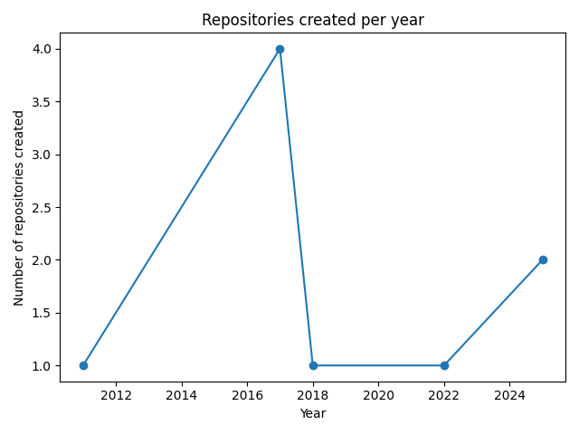
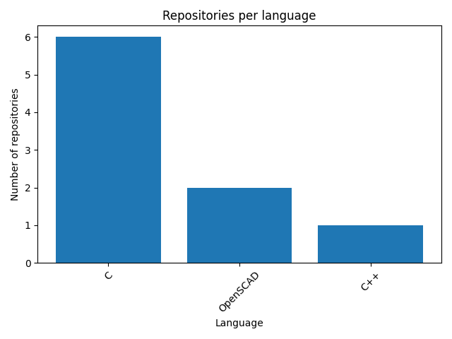

# GitHub Profile Analyzer – PRO
A professional, data-driven GitHub analytics dashboard with automated PDF reporting.

Analyze any public GitHub profile using the GitHub REST API.  
Generate insights, charts, tables, and export a full **PDF report** with one click.  
Designed for **recruiters**, **team leads**, and **developers**.

---

## 📌 Key Features

### **1. GitHub API Integration**
- Fetches user profile data via the GitHub REST API  
- Retrieves all public repositories  
- Handles missing users and API errors gracefully  

### **2. Data Processing with Pandas**
- Clean conversion from JSON → DataFrame  
- Top repositories by stars  
- Recently updated repositories  
- Language distribution  
- Repository activity by year  

### **3. Interactive Streamlit Dashboard**
- User overview (avatar, bio, stats, account age)  
- Repository table (sortable, clean, readable)  
- Language analysis (table + chart)  
- Activity metrics (table + chart)  
- Modern, responsive UI  

### **4. PDF Report Generator (ReportLab)**
One click → full PDF export including:

- User summary  
- Repository metrics  
- Language statistics  
- Activity trends  
- Embedded charts  

Perfect for sharing with:
- Hiring managers  
- Technical leads  
- Clients  
- Your portfolio  

---
## 📸 Screenshots

### Repository Analytics


### Language Distribution

---

## 🧠 Intended Users

This tool is designed for:

- **Recruiters** evaluating developer profiles  
- **Team leads** analyzing candidates  
- **Developers** wanting a visual summary of their GitHub account  
- **Freelancers** building API dashboards and automated reports  

---

## 📂 Project Structure

```text

github_profile_analyzer/
│
├── app/
│   ├── main.py                # Streamlit dashboard
│   ├── api_client.py          # GitHub API client
│   ├── data_processing.py     # Pandas transformations & metrics
│   ├── plots.py               # Matplotlib chart functions
│   └── report.py              # PDF generator
│
├── requirements.txt
├── README.md
└── .gitignore

```

---

## 🔧 Installation

### **1. Clone the repository**
```bash

git clone https://github.com/ceciagro/github_profile_analyzer_pro.git
    cd github_profile_analyzer_pro


# Create virtual environment (Mac/Linux)
python3 -m venv .venv
source .venv/bin/activate

# Install dependencies
pip install -r requirements.txt

streamlit run app/main.py

```

---

---

## ⚖️ Legal & Compliance

This project uses **only public information** from the official GitHub REST API  
(`https://api.github.com/users/{username}` and `https://api.github.com/users/{username}/repos`).

No private data, authentication tokens, or restricted endpoints are accessed.

All processed information is already publicly visible on GitHub and is handled in full compliance with:

- GitHub Terms of Service  
- GitHub Privacy Statement  
- GitHub REST API usage policies  

This tool does **not** store, redistribute, or modify any user data.  
It simply visualizes and summarizes public profile statistics for analysis, recruitment, and educational purposes.

---
---

## 📬 Contact & Author

- **Author:** Cecilia Ledesma
- **Email:** [cecledesma@gmail.com](mailto:cecledesma@gmail.com)
- **GitHub:** [github.com/ceciagro](https://github.com/ceciagro)
- **Upwork:** [Freelancer Profile](https://www.upwork.com/freelancers/cledesma)
- **Specializations:** Deep Learning (LSTM), Time Series Forecasting, Financial Modeling, MLOps

---
